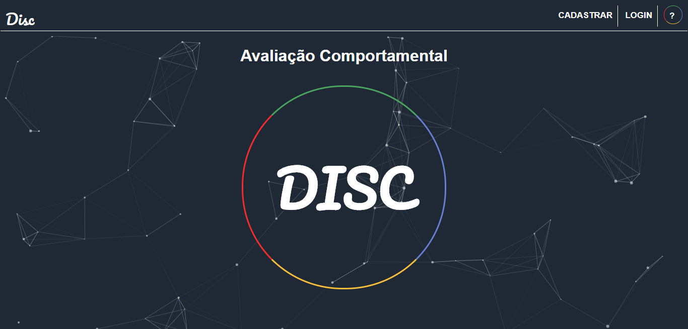

# Disc Web

This project is a behavioral assessment website called DISC, it was developed for the TCC of the Technical course in Systems Development at ETEC Irmã Agostina.



## Installation


```bash
Start xampp or similar
```
```bash
Upload the database (disc.sql)
```
```bash
Change connection credentials (funcoes / conexao.php)
```


## Usage

```bash
localhost/DISCweb
```


## License
- You can use the code for study.
- You may not use it for commercial purposes, subject to penalties under local law.
